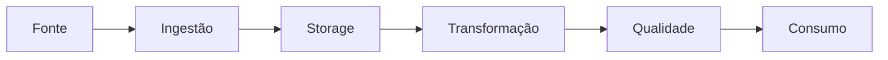

# Data Lakehouse de E-commerce

**Nível:** ★★★★★  
**Stack:** Python, PySpark, dbt, PostgreSQL, MinIO, Docker

## Objetivo

Construir uma versão pequena, reproduzível e didática de uma arquitetura usada no mercado.

O foco é entender o fluxo:

**fonte → ingestão → armazenamento → transformação → qualidade → consumo**

## O que este projeto demonstra

ETL/ELT, bronze-silver-gold, particionamento e modelagem analítica.

## Perguntas respondidas pelo projeto

- Onde os dados entram?
- Onde ficam persistidos?
- Qual transformação acontece em cada etapa?
- Como evitar duplicidade?
- Como tratar falhas?
- Como validar qualidade?
- Como tornar o pipeline reexecutável?
- Onde o custo e a performance começam a importar?

## Execução

```bash
docker compose up -d
python -m pip install -r requirements.txt
```

Consulte os arquivos de código e o `docker-compose.yml` para o fluxo específico.

## O que eu aprendi

O principal aprendizado aqui é conseguir explicar a arquitetura, suas decisões e seus limites.

## Fluxo mental


