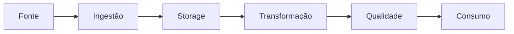

# Feature Store

O objetivo é separar a engenharia das features do treinamento do modelo.

Fluxo:
`eventos → Spark → features offline → Feast → treinamento/serving`

Em uma melhoria futura: adicionar `event_timestamp`, fonte histórica e uma store online real.

## Fluxo mental

